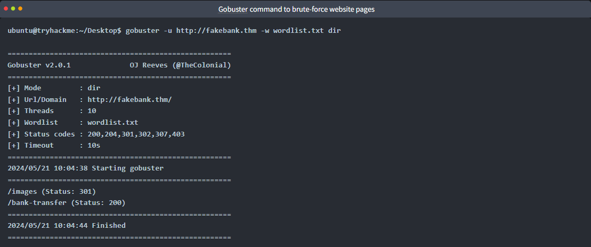

"To outsmart a hacker, you need to think like one."
This is the core of "Offensive Security." It involves breaking into computer systems, exploiting software bugs, and finding loopholes in applications to gain unauthorized access. The goal is to understand hacker tactics and enhance our system defences.

Beginning Your Learning Journey
In this TryHackMe room, you will be guided through hacking your first website in a legal and safe environment. The goal is to show you how an ethical hacker operates.

1. We will use a command-line application called "Gobuster" to brute-force FakeBank's website to find hidden directories and pages. 
Gobuster will take a list of potential page or directory names and try accessing a website with each of them; if the page exists, it tells you.

2. Use Gobuster To Find Hidden Website Pages
Most companies have an admin portal page, giving their staff access to basic admin controls for day-to-day operations. For a bank, an employee might need to transfer money to and from client accounts. 
Due to human error or negligence, there may be instances when these pages are not made private, 
allowing attackers to find hidden pages that show or give access to admin controls or sensitive data.
To begin, type the following command into the terminal to find potentially hidden pages on FakeBank's website using Gobuster (a command-line security application).

/----------------------------
gobuster -u http://fakebank.thm -w wordlist.txt dir
/----------------------------

3. In the command above, -u is used to state the website we're scanning, -w takes a list of words to iterate through to find hidden pages.
You will see that Gobuster scans the website with each word in the list, finding pages that exist on the site. Gobuster will have told you the pages in the list of page/directory names (indicated by Status: 200).

