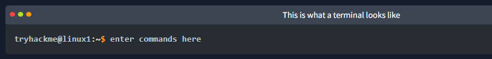
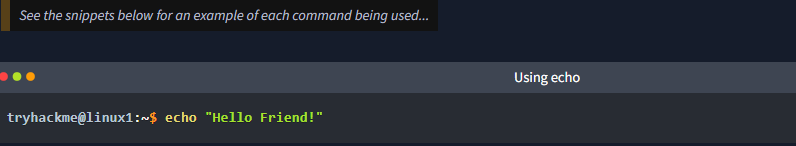
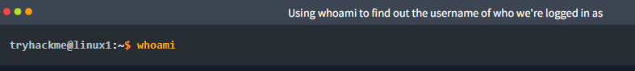

As we previously discussed, a large selling point of using OSs such as Ubuntu is how lightweight they can be. This, of course, doesn't come without its disadvantages, where for example, often there is no GUI (Graphical User Interface) or what is also known as a desktop environment that we can use to interact with the machine (unless it has been installed). A large part of interacting with these systems is using the "Terminal".

The "Terminal" is purely text-based and is intimidating at first. However, if we break down some of the commands, after some time, you quickly become familiar with using the terminal!

We need to be able to do basic functions like navigate to files, output their contents and make files! The commands to do so are self-explanatory (once you know what they are of course...)

Let's get started with two of the first commands which I have broken down in the table below:

