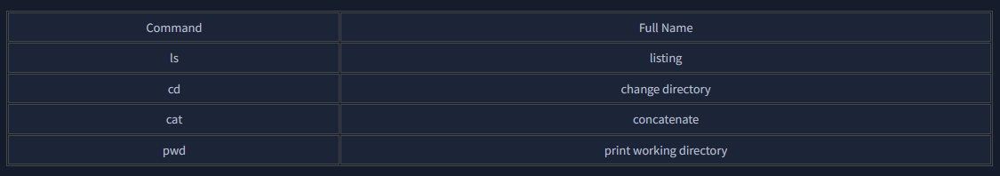
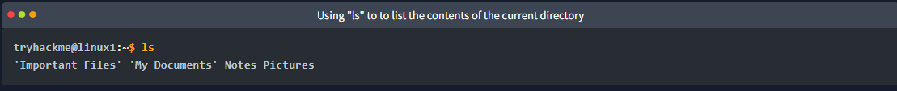
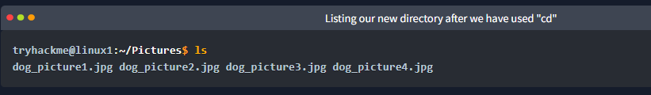
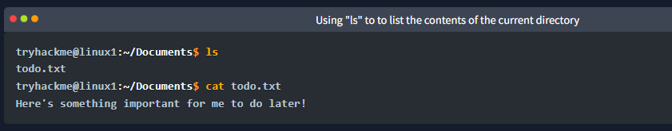
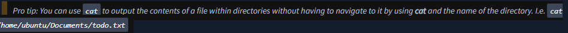
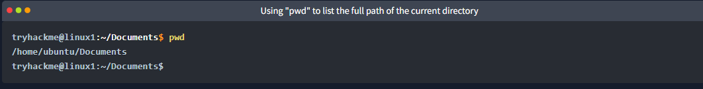

So far we've only covered the "echo" and "whoami" commands. Not all that useful when you consider things that we need to do - including navigating the filesystem, read and write to it as well.

In this task, we're going to be learning the commands so that we can do just that. Just like the previous task, I'll display the commands in the table in the next heading & show examples of these commands being used.
### Interacting With the Filesystem

As I previously stated, being able to navigate the machine that you are logged into without relying on a desktop environment is pretty important. After all, what's the point of logging in if we can't go anywhere?

### Listing Files in Our Current Directory (ls)

Before we can do anything such as finding out the contents of any files or folders, we need to know what exists in the first place. This can be done using the "ls" command (short for listing)

In the screenshot above, we can see there are the following directories/folders:

* Important Files
* My Documents
* Notes
* Pictures

Great! You can probably take a guess as to what to expect a folder to contain given by its name.

### Changing Our Current Directory (cd)

Now that we know what folders exist, we need to use the "cd" command (short for change directory) to change to that directory. Say if I wanted to open the "Pictures" directory - I'd do "cd Pictures". Where again, we want to find out the contents of this "Pictures" directory and to do so, we'd use "ls" again:

In this case, it looks like there are 4 pictures of dogs!

### Outputting the Contents of a File (cat)
Whilst knowing about the existence of files is great — it's not all that useful unless we're able to view the contents of them.

We will come on to discuss some of the tools available to us that allows us to transfer files from one machine to another in a later room. But for now, we're going to talk about simply seeing the contents of text files using a command called "cat".

"Cat" is short for concatenating & is a fantastic way for us to output the contents of files (not just text files!).

In the screenshot below, you can see how I have combined the use of "ls" to list the files within a directory called "Documents":

We've applied some knowledge from earlier in this task to do the following:

1. Used "ls" to let us know what files are available in the "Documents" folder of this machine. In this case, it is called "todo.txt".
2. We have then used cat todo.txt to concatenate/output the contents of this "todo.txt" file, where the contents are "Here's something important for me to do later!"

Sometimes things like usernames, passwords (yes - really...), flags or configuration settings are stored within files where "cat" can be used to retrieve these.

### Finding out the full Path to our Current Working Directory (pwd)
You'll notice as you progress through navigating your Linux machine, the name of the directory that you are currently working in will be listed in your terminal.

It's easy to lose track of where we are on the filesystem exactly, which is why I want to introduce "pwd". This stands for print working directory.

Using the example machine from before, we are currently in the "Documents" folder — but where is this exactly on the Linux machine's filesystem? We can find this out using this "pwd" command like within the screenshot below:

### Let's break this down:

* We already know we're in "Documents" thanks to our terminal, but at this point in time, we have no idea where "Documents" is stored so that we can get back to it easily in the future.
* I have used the "pwd" (print working directory) command to find the full file path of this "Documents" folder.
* We're helpfully told by Linux that this "Documents" directory is stored at "/home/ubuntu/Documents" on the machine — great to know!
* Now in the future, if we find ourselves in a different location, we can just use cd /home/ubuntu/Documents to change our working directory to this "Documents" directory.
